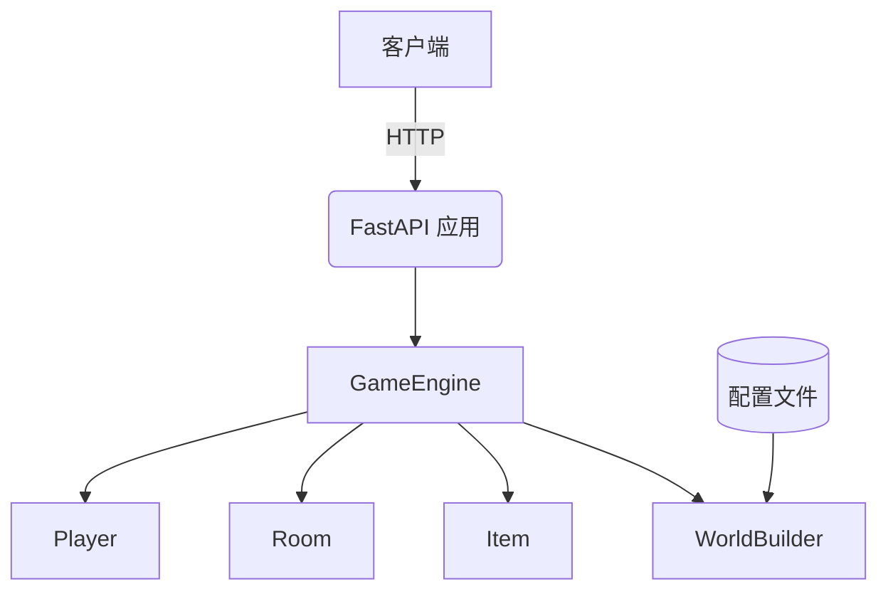

# OurTeam-Project2026
软件工程实践 · 文字冒险游戏后端

## 项目简介
这是一个基于 FastAPI 的文字冒险游戏后端，支持通过 REST API 进行游戏交互。游戏设定在一个古老宅邸中，玩家可以探索房间、拾取物品。

## 团队成员
PO：李东毅

SM：张智霖

DT：周文杰

## 系统架构


## 项目结构
```
OurTeam-Project2026
├─ README.md
├─ api.py              # FastAPI 应用入口
├─ docs/
│  └─ openapi.yaml     # API 文档
├─ game.py             # 游戏引擎核心逻辑
├─ item.py             # 物品类
├─ main.py             # 命令行游戏入口
├─ player.py           # 玩家类
├─ requirements.txt    # Python 依赖
├─ room.py             # 房间类
└─ tests/              # 单元测试
   ├─ test_api.py      # API 测试
   ├─ test_game_mock.py
   ├─ test_item.py
   ├─ test_player.py
   └─ test_room.py
```

## 核心模块职责
| 模块 | 职责 |
|----|----|
| api.py | REST API，会话管理 |
| game.py | 游戏核心逻辑 |
| player.py | 玩家状态与行为 |
| room.py | 房间与出口 |
| item.py | 物品定义 |

## 技术栈
- Python 3.11+
- FastAPI
- Pytest
- GitHub Actions (CI)
